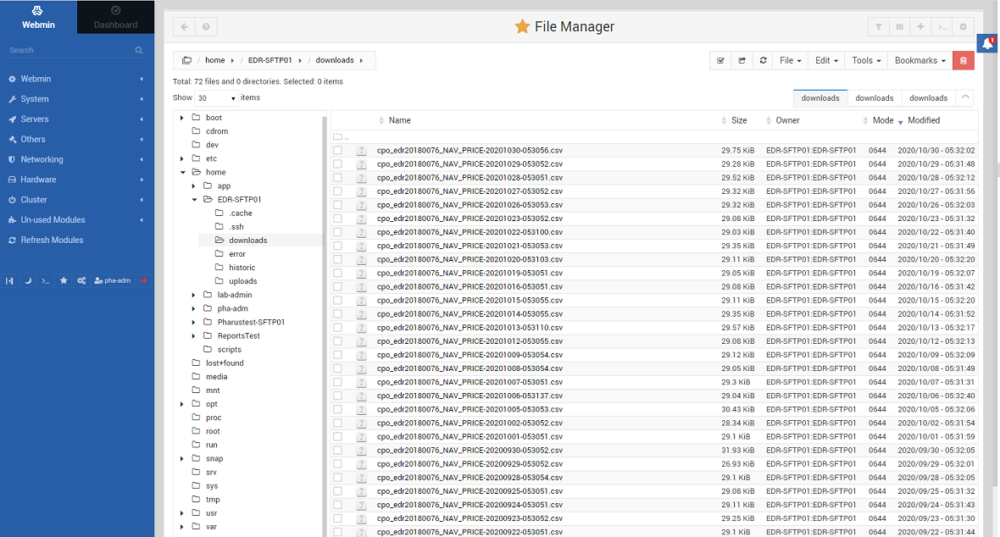
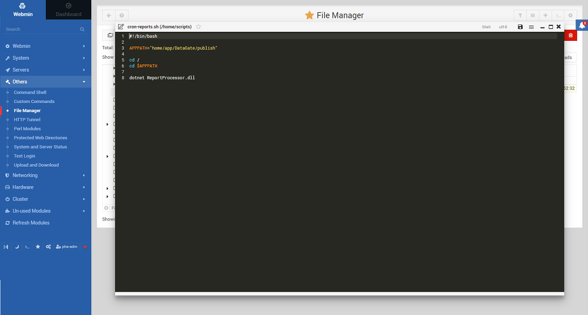
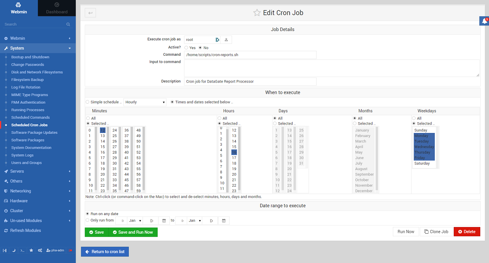
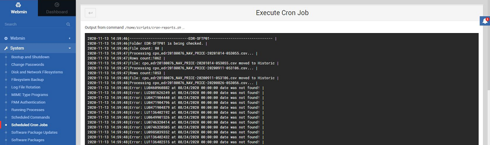

# DataGate Report

.NET Core console application running on Ubuntu 20.04 SFTP Linux Server.  
This tool was created to manage the reporting part of [DataGate Web](https://github.com/PhilShishov/DataGate)  
The main function is automatic feeding of data into an internal database by the Fund Admin (Asset under management, Subscription, Redeption, Net asset value)
 1. Receive input from client reports - .csv, .xlsx 
 
 
 2. Manipulate data through SFTP Server - bash script, cron job
 
 
 
 3. Process data: send to DataGate DB to be displayed in web platform or to error folder 

## Technologies
* C# .NET 6
* SQL Server, Ubuntu 20.04
* XML, NLog
* CsvHelper, ToDataTable
